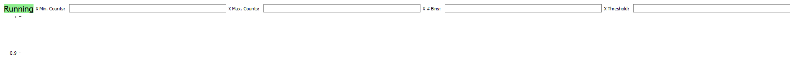

# ORCA Flash Capture

**A capture and image analysis application designed for the Hamamatsu ORCA-Flash 4.0.**

Used Projects:

**micropolimi/HamamatsuCamera** - A Python driver which supplies methods to control the ORCA Flash camera by connecting to the Hamamatsu DLL file.

**ssquantum/saia** - An image analysis software designed for single atom detection. Applies a histogram to received images to measure number of counts.

This project involves the merging of the **HamamatsuCamera** driver functionality into the **SAIA** application so images can be captured and fed in for analysis.

## Menu Guide

### Capture Tab

- **Live** mode allows for a continuous feed of images. This is useful for making changes to the experiment and quickly seeing how this affects your image.
- **External Capture** will take an image when the camera is externally triggered. This is useful for taking images during a sequence.
- **Single Frame** will take one image using the internal trigger of the software. Useful for setting up the ROI.
- **Threshold Reset** when toggled will trigger the sequence software to restart the sequence if the last run showed counts below the threshold.
- **Capture Dimensions** set a subsection of the camera sensor to take images. This helps speed up the program and greatly reduce the size of stored images.
- **Exposure** sets the exposure of the camera. Long exposures will cause problems with the software as images take longer to capture than the frame check cycle time.
- **Status** details which function the program is currently trying to run.

### Histogram Tab

- **Status** will display _running_ over normal operation. When the threshold reset is triggered this status will display _reset_ in red to notify the user that the sequence and all data will be reset on next image capture.
- **Histogram Settings** help adjust the histogram to exactly the state you are looking for
- **Threshold** allows for a manual threshold to be set. For this manual threshold to be used over the automatic threshold the in the top menu **Histogram → User Threshold.**
- Data in this histogram can be manually reset using the top menu **Histogram → Reset Histogram → Reset all.**

### Image Tab

- **Image Size in Pixels** displays the total pixel number (length x height) for each taken
- **Auto Display** will load images taken under the filewatch into the canvas during the same step as histogram plotting. This is on by default.
- **Colormap** applies a *jet* colour map to the image loaded in. This currently only affects the images on load in and cannot change an already loaded in image. When toggle is not selected then the default raw greyscale image is used.
- **ROI Selection** shows the exact dimensions of the ROI which is visually represented by the orange box.
- **Counts** shows the number of counts within the ROI of the newest image

## Future Changes

- Colormap settings to pick contrast idea for the image
- Colormap toggle to work instantly rather than only affecting new images
- Display a summed image of all images taken